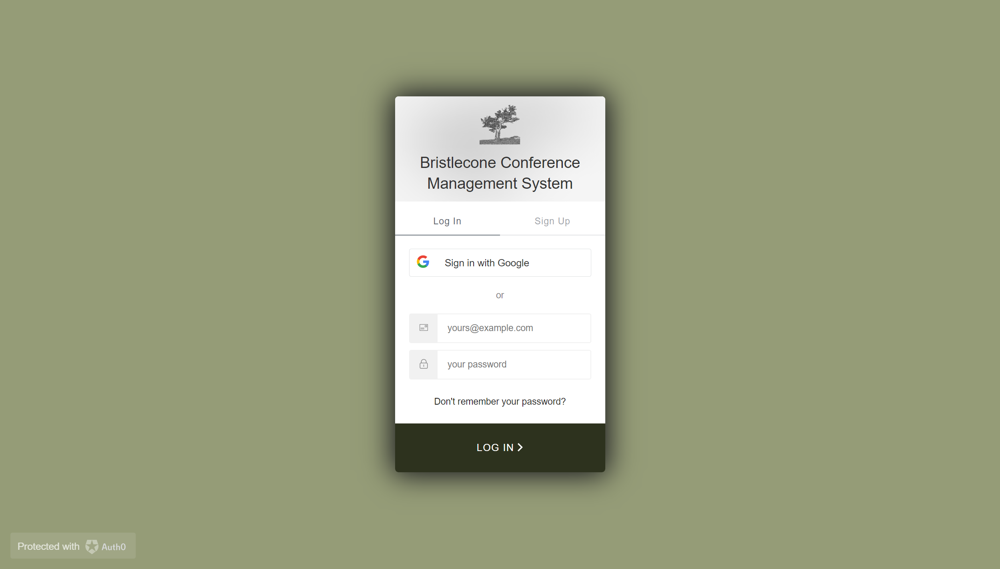
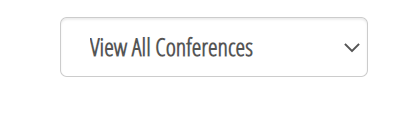
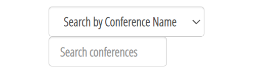
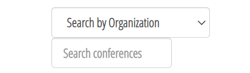
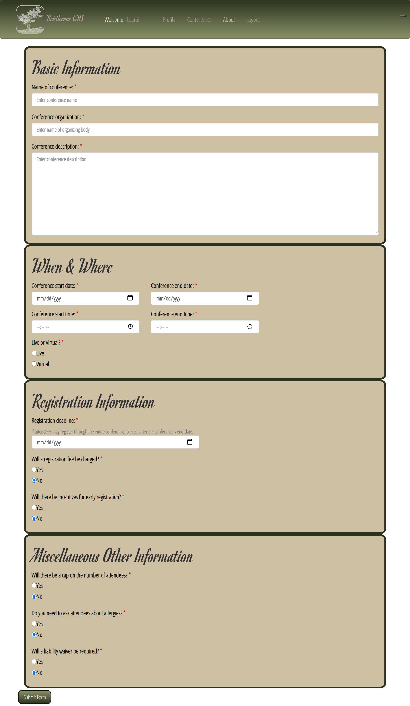

# Bristlecone Conference Management System

## Table of Contents

* [Description](#description)
* [Links](#links)
* [Screenshots](#screenshots)
* [Installation Instructions](#installation-instructions)
* [Usage](#usage)
* [Technologies Used](#technologies-used)
* [Tests](#tests)
* [Credits](#credits)
* [Contributing](#contributing)
* [Questions](#questions)
* [Badges](#badges)

## Description

This application uses a MERN stack to create a conference management system.

## Links

[Deployed application on Heroku](https://#) NOT DEPLOYED YET

## Screenshots

Landing page:

Login page:

Profile page:

Individual conference information, default:

Individual conference information, conference's creator:

Individual conference information, conference admins:

Individual conference information, registered attendee:

Individual conference information, registered exhibitor:

All Conferences page:

User input form on All Conferences page:

  

Conference Details page:

Conference Schedule page:

Add New Conference form:

Add Session form:

"About" page:

## Installation Instructions

npm install

## Usage

This project is intended to be used to create and manage conferences, conventions, seminars, and similar events.

## Technologies Used

MongoDB, Express, React, Node.js, GraphQL, JavaScript, TypeScript, auth0.com, Moment, multer, thenBy.js

## Tests

npm run test

## Credits

The original version of this application was developed in collaboration with [Anna Battista](https://github.com/abattista24), [Beni Mahat](https://github.com/benimahat1291), [Travis Messall](https://github.com/tmessall), [Brenda Miller](https://github.com/millerbee), and [Alec Rewinkel](https://github.com/arewinkl) under the name "Cool Cats Conference Planner," which can be found in this repo [here](https://github.com/LauraCole1900/conferencePlanner) and is deployed on Heroku [here](https://conference-planner.herokuapp.com/).

[thenBy.js](https://github.com/Teun/thenBy.js) was created by [Teun Duynstee](https://github.com/Teun).

"Cancel event" icon made by [Those Icons](https://www.flaticon.com/authors/those-icons) from [www.flaticon.com](https://www.flaticon.com/).

Dragon image used on the 404 page created by [Hannah Hill](https://freepngimg.com/author/hannahhil-5479) and found at [FreePNG.com](https://freepngimg.com/png/2678-tattoo-dragon-png-image).

## Contributing

We believe code is never finished, and welcome your contributions to enhance the application's functionality. Please adhere to the Code of Conduct for the Contributor Covenant, version 2.0, at https://www.contributor-covenant.org/version/2/0/code_of_conduct.html.

## Questions

If you have further questions, you can reach me at lauracole1900@comcast.net. For more of my work, see [my GitHub](https://github.com/LauraCole1900).

## Badges

 